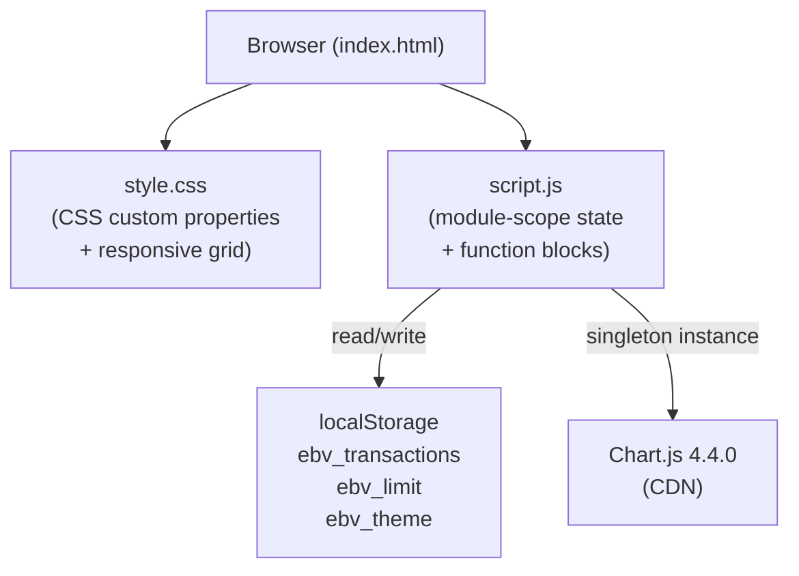

# Design Document — Expense & Budget Visualizer

## Overview

The Expense & Budget Visualizer is a **client-side single-page application (SPA)** that runs entirely in the browser with no server, no build pipeline, and no JavaScript framework. It is delivered as a static bundle of three files:

| File | Role |
|---|---|
| `index.html` | Structure — semantic markup, ARIA labels, CDN script tag |
| `css/style.css` | Presentation — CSS custom properties, mobile-first grid, dark/light theme |
| `js/script.js` | Behaviour — state, persistence, validation, rendering, Chart.js integration |

The only external dependency is **Chart.js 4.4.0** loaded from jsDelivr CDN. All application data is stored in **`localStorage`** under three well-known keys, making the app fully offline-capable after first load.

The design goal is extreme simplicity: every feature maps to a named function block inside `script.js`, state is a handful of module-scope variables, and the render cycle is always triggered through a single `renderAll()` call.

---

## Architecture



**Data flow:**

1. On `DOMContentLoaded`, `loadFromStorage()` hydrates module-scope state from `localStorage`.
2. User interactions (form submit, delete click, sort change, theme toggle, limit set, month select) call one or more state-mutating functions, then call `renderAll()`.
3. `renderAll()` is the single re-render gate — it calls four independent render functions in sequence, each reading from module-scope state and writing to the DOM.
4. Any mutation that should persist calls the appropriate `saveXxx()` helper, which serialises state to `localStorage` synchronously.

There is no virtual DOM, no reactive framework, and no event bus. DOM updates are **imperative**: each render function clears and rewrites its own DOM subtree from scratch, except `renderChart()` which updates the Chart.js instance in place to avoid unnecessary re-creation.

---

## Components and Interfaces

The `script.js` file is organised into eleven clearly-labelled sections. Each section owns a specific concern.

### Section 1 — Persistence

| Function | Purpose |
|---|---|
| `loadFromStorage()` | Deserialises `ebv_transactions` (JSON), `ebv_limit` (Number), and calls `applyTheme` with `ebv_theme`. Silently handles parse errors. |
| `saveTransactions()` | Serialises `transactions` array to JSON and writes to `ebv_transactions`. |
| `saveLimit()` | Writes `spendingLimit` string to `ebv_limit`. |

### Section 2 — Theme

| Function | Purpose |
|---|---|
| `applyTheme(theme)` | Sets `data-theme` attribute on `<html>`, updates toggle button icon and `aria-label`, persists to `ebv_theme`. |
| `toggleTheme()` | Reads current `data-theme`, inverts it, calls `applyTheme`, then calls `renderChart()` to repaint chart colours. |

### Section 3 — Balance

| Function | Purpose |
|---|---|
| `getTotalSpent()` | Pure function: reduces `transactions` array to numeric sum of all `amount` fields. |
| `formatCurrency(amount)` | Pure function: formats a number as Indonesian Rupiah string using `id-ID` locale with `Rp` prefix. |
| `renderBalance()` | Writes formatted total to `#totalBalance`, shows/hides `#limitWarning`, toggles `over-limit` CSS class. |

### Section 4 — Spending Limit

| Function | Purpose |
|---|---|
| `initLimit()` | Pre-fills `#limitInput` from `spendingLimit`; wires `#setLimitBtn` click handler. |

### Section 5 — Form

| Function | Purpose |
|---|---|
| `clearErrors()` | Removes `.error` class and clears error text from all four form fields. |
| `showError(fieldId, message)` | Adds `.error` class and sets error text for a specific field. |
| `validateForm(name, amount, category, date)` | Pure validation predicate. Calls `showError` for each failing field; returns `false` if any field is invalid. |
| `addTransaction(name, amount, category, date)` | Creates transaction object with `crypto.randomUUID()` and `Date.now()`, pushes to `transactions`, calls `saveTransactions()`. |
| `getTodayISO()` | Returns today as `"YYYY-MM-DD"` string using local time. |
| `initForm()` | Sets date field default, wires `submit` event on `#transactionForm`. |

### Section 6 — Transaction List

| Function | Purpose |
|---|---|
| `getSortedTransactions()` | Reads `#sortBy` select value; returns a sorted **copy** of `transactions` (never mutates original). |
| `formatDateDisplay(dateStr)` | Converts `"YYYY-MM-DD"` to `"D Mon YYYY"` in `id-ID` locale by parsing components locally (avoids UTC offset shift). |
| `createTransactionItem(transaction)` | Builds a `<li>` DOM node with all display fields and wires the delete button handler. |
| `renderTransactionList()` | Clears `#transactionList`, shows empty state or appends sorted items via `DocumentFragment`. |
| `deleteTransaction(id)` | Filters `transactions` by id, calls `saveTransactions()`, calls `renderAll()`. |
| `initSort()` | Wires `change` event on `#sortBy` to call `renderTransactionList`. |

### Section 7 — Chart

| Function | Purpose |
|---|---|
| `getCategoryTotals()` | Pure function: reduces `transactions` into `{ [category]: totalAmount }` object. |
| `renderChart()` | If no data: destroys any existing chart instance, shows placeholder. If data exists: updates chart in place (mutates `chartInstance.data`) or creates a new singleton `Chart` instance. |

### Section 8 — Monthly Summary

| Function | Purpose |
|---|---|
| `getMonthKey(dateStr)` | Slices `"YYYY-MM-DD"` to `"YYYY-MM"`. |
| `formatMonthLabel(key)` | Converts `"YYYY-MM"` to long locale month label (e.g., `"September 2026"`). |
| `getAvailableMonths()` | Collects unique month keys from `transactions`, returns sorted descending (most recent first). |
| `renderMonthlySummary()` | Rebuilds `#monthSelector` options, restores prior selection if still valid, then renders total and breakdown. |
| `initMonthlySummary()` | Wires `change` event on `#monthSelector` to call `renderMonthlySummary`. |

### Section 9 — Render All

| Function | Purpose |
|---|---|
| `renderAll()` | Calls `renderBalance()`, `renderTransactionList()`, `renderChart()`, `renderMonthlySummary()` in sequence. Always safe to call redundantly — each function is idempotent given the same state. |

### Section 10 — Utility

| Function | Purpose |
|---|---|
| `escapeHtml(str)` | Pure function: replaces the five HTML special characters (`&`, `<`, `>`, `"`, `'`) with their HTML entity equivalents to prevent XSS when injecting user content via `innerHTML`. |

### Section 11 — Initialisation

The `DOMContentLoaded` handler is the single entry point. It calls all `initXxx()` functions and then `renderAll()` for the first paint.

---

## Data Models

### Transaction

The core domain object. Stored in `transactions[]` (in-memory) and serialised as a JSON array under the `ebv_transactions` key.

```typescript
interface Transaction {
  id:        string;   // crypto.randomUUID() — v4 UUID, globally unique
  name:      string;   // User-supplied item name, trimmed, 1–100 chars
  amount:    number;   // Positive number representing IDR amount (integer in practice)
  category:  'Food' | 'Transport' | 'Fun' | 'Lifestyle';
  date:      string;   // ISO date string "YYYY-MM-DD" (local time, from <input type="date">)
  createdAt: number;   // Unix timestamp in ms (Date.now()) — used for sort tie-breaking
}
```

**Invariants:**
- `id` is unique across all transactions in the array.
- `amount` is strictly greater than 0.
- `name.trim().length` is between 1 and 100 inclusive.
- `category` is exactly one of the four enumerated values.
- `date` matches the pattern `\d{4}-\d{2}-\d{2}`.

### Module-Scope State

```typescript
let transactions:  Transaction[] = [];   // Loaded from ebv_transactions; source of truth for all rendering
let spendingLimit: number        = 0;    // 0 = no limit; loaded from ebv_limit
let chartInstance: Chart | null  = null; // Chart.js singleton; null before first transaction
```

### LocalStorage Schema

| Key | Type | Format | Default |
|---|---|---|---|
| `ebv_transactions` | `string` (JSON) | `Transaction[]` serialised as JSON array | `"[]"` (or absent) |
| `ebv_limit` | `string` | Numeric string, e.g. `"500000"` | `"0"` (or absent) |
| `ebv_theme` | `string` | `"light"` or `"dark"` | `"light"` (or absent) |

### Category Lookup Tables

Two constant maps provide O(1) lookup for rendering:

```javascript
const CATEGORY_EMOJI = {
  Food: '🍔', Transport: '🚌', Fun: '🎮', Lifestyle: '✨'
};

const CATEGORY_COLORS = {
  Food: '#48bb78', Transport: '#4299e1', Fun: '#ed8936', Lifestyle: '#9f7aea'
};
```

---

## Key Algorithms

### Balance Calculation

`getTotalSpent()` is a linear reduction over `transactions`:

```
totalSpent = Σ t.amount  for all t in transactions
```

`formatCurrency(amount)` uses the browser's built-in `Intl.NumberFormat` via `toLocaleString('id-ID')` to apply Indonesian thousand separators (`.`), then prepends `"Rp "`.

### Sort Algorithm

`getSortedTransactions()` creates a **shallow copy** (`[...transactions]`), then applies `Array.prototype.sort` with a comparator chosen by the `#sortBy` dropdown value:

| Option key | Primary comparator | Tie-break |
|---|---|---|
| `date-desc` (default) | `b.createdAt - a.createdAt` | — |
| `date-asc` | `a.createdAt - b.createdAt` | — |
| `amount-desc` | `b.amount - a.amount` | `b.createdAt - a.createdAt` |
| `amount-asc` | `a.amount - b.amount` | `b.createdAt - a.createdAt` |
| `category` | `a.category.localeCompare(b.category)` | `b.createdAt - a.createdAt` |

The original `transactions` array is **never mutated** by sorting. Tie-breaking for non-date sorts falls back to `createdAt` descending, satisfying Requirement 6.6.

### Monthly Grouping

`getAvailableMonths()` collects unique `"YYYY-MM"` keys from `transactions.map(t => t.date.slice(0,7))`, then sorts them lexicographically descending (ISO format means lexicographic order equals chronological order).

`renderMonthlySummary()` filters `transactions` to those whose month key matches the selected value, then reduces to a `{ [category]: sum }` map. The breakdown is rendered sorted by value descending.

### Category Totals

`getCategoryTotals()` is a linear scan:

```
for each transaction t:
  totals[t.category] += t.amount
```

Returns a plain object. The Chart.js dataset is built by calling `Object.keys(totals)` for labels and `Object.values(totals)` for data. Only categories that have at least one transaction appear in the chart.

### XSS Escaping

`escapeHtml(str)` applies five sequential `String.prototype.replace` calls with literal strings (not regex) to avoid regex-injection edge cases:

```
& → &amp;   (must be first to avoid double-escaping)
< → &lt;
> → &gt;
" → &quot;
' → &#039;
```

The output is safe to inject via `innerHTML`. The function is applied to `name` at every `innerHTML` insertion site.

---

## Chart.js Integration Pattern

The chart is managed as a **singleton** via the module-scope `chartInstance` variable.

```
First render (chartInstance === null):
  → new Chart(canvas, config)         assigns chartInstance

Subsequent renders (chartInstance !== null):
  → chartInstance.data.labels = [...]
  → chartInstance.data.datasets[0].data = [...]
  → chartInstance.update()            smooth in-place animation

Zero-data case:
  → chartInstance.destroy()           releases Canvas 2D context
  → chartInstance = null
  → canvas.style.display = 'none'
  → placeholder shown
```

**Rationale for in-place update:** destroying and recreating the Chart instance on every `renderAll()` call causes a flash of blank canvas and loses zoom/interaction state. In-place mutation with `.update()` gives smooth 400 ms animation.

**Theme-aware colors:** On each `renderChart()` call, `isDark` is read from `document.documentElement.getAttribute('data-theme')`. Legend text color and segment border color are computed fresh and applied to the dataset and options before calling `.update()`.

---

## Theming System

Theme state is held in two places that must stay in sync:

1. **`data-theme` attribute** on `<html>` — consumed by CSS via `[data-theme="dark"] { ... }` rules.
2. **`ebv_theme` in `localStorage`** — persisted across sessions.

`applyTheme(theme)` is the single function that writes both. It also updates the toggle button's `textContent` and `aria-label`.

CSS custom properties declared on `:root` (light mode defaults) are overridden by `[data-theme="dark"]` block:

```
:root                    → light mode custom property values
[data-theme="dark"]      → dark mode custom property values
```

All component styles reference custom properties (`var(--color-bg)`, `var(--color-surface)`, etc.), so a single attribute flip on `<html>` cascades the entire color scheme without any JavaScript DOM manipulation beyond the one `setAttribute` call.

**Chart.js does not consume CSS custom properties**, so `renderChart()` must explicitly read `isDark` and pass computed color strings to the Chart.js config.

---

## Responsive Layout Breakpoints

The layout uses a CSS Grid on `.app-main` with breakpoints defined via `@media`:

| Breakpoint | Columns | Notes |
|---|---|---|
| `< 640px` (mobile) | 1 column | All three sections stack vertically |
| `640px – 1023px` (tablet) | 2 columns | Col 1: Balance+Form. Col 2: Chart+Summary. Transaction List spans full width (`grid-column: 1 / -1`) |
| `≥ 1024px` (desktop) | 3 equal columns | Balance+Form | Chart+Summary | Transaction List, each in its own column |

The header uses `position: sticky; top: 0` so it remains visible during vertical scroll on all viewport sizes.

Cards use `border-radius: 16px`, `box-shadow`, and `background-color: var(--color-surface)` and adapt automatically to theme changes via custom properties.

---

## Correctness Properties

*A property is a characteristic or behavior that should hold true across all valid executions of a system — essentially, a formal statement about what the system should do. Properties serve as the bridge between human-readable specifications and machine-verifiable correctness guarantees.*

### Property 1: Transaction field preservation

*For any* valid combination of (name, amount, category, date) inputs, the Transaction object produced by `addTransaction` must contain exactly those values (with name trimmed), plus a non-empty `id` string and a positive numeric `createdAt` timestamp.

**Validates: Requirements 1.2**

---

### Property 2: Storage round-trip for transactions

*For any* sequence of add and delete operations, `JSON.parse(localStorage.getItem('ebv_transactions'))` must equal the current in-memory `transactions` array (deep equality on all fields).

**Validates: Requirements 1.3, 10.1**

---

### Property 3: Whitespace item names are rejected

*For any* string composed entirely of whitespace characters (spaces, tabs, newlines, or any mix thereof), submitting it as the item name must cause `validateForm` to return `false` and must not result in a new transaction being added.

**Validates: Requirements 2.1**

---

### Property 4: Invalid amount values are rejected

*For any* amount value that is empty, non-numeric, zero, negative, or exceeds 999,999,999, `validateForm` must return `false` and must not result in a new transaction being added.

**Validates: Requirements 2.2, 2.8**

---

### Property 5: Item name length boundary

*For any* string whose length exceeds 100 characters, `validateForm` must return `false`, the name error element must contain a non-empty error message, and no transaction must be created.

**Validates: Requirements 2.7, 12.3**

---

### Property 6: Simultaneous multi-field error display

*For any* non-empty subset of the four form fields that are simultaneously invalid, all corresponding error messages must be visible in the DOM at the same time after a single failed submit attempt.

**Validates: Requirements 2.6**

---

### Property 7: Delete removes only the targeted transaction

*For any* non-empty transaction array and any transaction `t` within it, after `deleteTransaction(t.id)`, the resulting array must not contain any element with `id === t.id`, and must still contain all other transactions unchanged.

**Validates: Requirements 3.2**

---

### Property 8: Balance equals sum of all amounts

*For any* transaction array, `getTotalSpent()` must equal the exact arithmetic sum of all `amount` fields. When the array is empty, `getTotalSpent()` must return `0`.

**Validates: Requirements 4.1, 4.3**

---

### Property 9: IDR currency formatting

*For any* non-negative integer amount, `formatCurrency(amount)` must produce a string that starts with `"Rp "` and uses `.` (period) as the thousands separator according to the `id-ID` locale (e.g., `formatCurrency(1250000)` → `"Rp 1.250.000"`).

**Validates: Requirements 4.1**

---

### Property 10: Spending limit warning predicate

*For any* `(totalSpent, spendingLimit)` pair: when `spendingLimit > 0` and `totalSpent > spendingLimit`, the `#limitWarning` element must not be hidden and the balance card must have the `over-limit` class. When `totalSpent <= spendingLimit` or `spendingLimit === 0`, the warning must be hidden and the `over-limit` class must be absent.

**Validates: Requirements 5.4, 5.5, 5.6**

---

### Property 11: Sort does not mutate source array

*For any* transaction array and any sort option, `getSortedTransactions()` must return a new array containing the same elements in the selected order, and the original `transactions` module variable must remain unchanged (same length, same elements, same order as before the call).

**Validates: Requirements 6.4**

---

### Property 12: Sort tie-breaking by creation timestamp

*For any* transaction array that contains two or more transactions sharing the same value for the active sort key (amount or category), those tied transactions must appear in the sorted output ordered by `createdAt` descending.

**Validates: Requirements 6.6**

---

### Property 13: Chart singleton identity preserved on data change

*For any* non-empty initial state and any subsequent add or delete that leaves the transaction list non-empty, the `chartInstance` object reference must be the same before and after `renderChart()` is called (i.e., the chart is updated in place, not destroyed and recreated).

**Validates: Requirements 7.2**

---

### Property 14: Tooltip label format

*For any* (segmentValue, datasetTotal) pair where both are positive numbers, the Chart.js tooltip callback must produce a string containing the amount formatted as `"Rp X.XXX"` (IDR locale) and the percentage formatted as a one-decimal-place string ending with `%` (e.g., `"Rp 50.000  (25.0%)"`).

**Validates: Requirements 7.7**

---

### Property 15: Available months ordering

*For any* transaction array, `getAvailableMonths()` must return the unique set of `"YYYY-MM"` month keys present in the array, sorted in descending lexicographic order (most recent month first), with no duplicates.

**Validates: Requirements 8.1**

---

### Property 16: Monthly aggregation correctness and breakdown order

*For any* non-empty transaction array and any selected month key, the displayed monthly total must equal the arithmetic sum of all transaction amounts whose `date` starts with that month key; and the per-category breakdown list must be sorted by category total in descending order.

**Validates: Requirements 8.2, 8.3, 8.4**

---

### Property 17: Theme toggle round-trip

*For any* initial theme value (`"light"` or `"dark"`), calling `toggleTheme()` twice must return the `data-theme` attribute, the toggle button icon, and the `ebv_theme` localStorage value to their original state.

**Validates: Requirements 9.4**

---

### Property 18: Corrupt storage recovery

*For any* string stored in `ebv_transactions` that cannot be parsed as valid JSON, `loadFromStorage()` must complete without throwing an exception, and the `transactions` array must be initialized to `[]`.

**Validates: Requirements 10.5**

---

### Property 19: Invalid spending limit recovery

*For any* value stored in `ebv_limit` that is absent, non-numeric, `NaN`, negative, or `Infinity`, `loadFromStorage()` must initialize `spendingLimit` to `0`.

**Validates: Requirements 10.6**

---

### Property 20: HTML escaping completeness

*For any* string that may contain one or more of the five special HTML characters (`&`, `<`, `>`, `"`, `'`), `escapeHtml(str)` must replace every occurrence with its corresponding HTML entity, and must not alter any characters that are not in that set. Applying `escapeHtml` to an already-escaped string must not double-escape entities.

**Validates: Requirements 12.1, 12.2**

---

## Error Handling

### LocalStorage Unavailability

`loadFromStorage()` wraps the `JSON.parse` call in a `try/catch`. If the parse throws (malformed JSON, quota errors, or `localStorage` blocked by browser privacy settings), `transactions` is reset to `[]` and execution continues silently. Similar defensive patterns should be applied to `saveTransactions()` and `saveLimit()`.

**Design decision:** The current implementation does not show a user-facing error for storage write failures (Requirement 1.7, 3.5 specify a visible error message). A `trySave(key, value)` wrapper function that catches `DOMException` and displays a non-blocking toast/banner is the recommended extension.

### Form Validation Errors

Errors are displayed inline, immediately beneath each field, using `<span class="error-msg">` elements that are always present in the DOM. `showError` writes to `.textContent` (not `innerHTML`) to prevent any XSS via the error message string. `clearErrors` runs before every validation pass to reset prior state.

### Chart.js Errors

If `Chart` is not defined (CDN failed to load), `renderChart()` will throw a `ReferenceError`. The recommended mitigation is to add a `typeof Chart !== 'undefined'` guard in `renderChart()` and display a static fallback message inside `#chartEmpty`.

### Date Parsing

`formatDateDisplay` and `getMonthKey` split the date string by `-` and use `new Date(y, m-1, d)` with numeric components to avoid the UTC offset issue that occurs when parsing `"YYYY-MM-DD"` directly with `new Date(dateStr)` (which treats the string as UTC midnight, potentially displaying the previous day in negative-UTC-offset locales).

---

## Testing Strategy

### Dual Testing Approach

This project uses two complementary test layers:

- **Unit tests**: verify specific examples, edge cases, error conditions, and DOM integration points.
- **Property-based tests**: verify universal properties across a wide range of generated inputs.

### Property-Based Testing

**Library:** [fast-check](https://fast-check.dev/) for JavaScript.

Each property listed in the Correctness Properties section is implemented as a single property-based test configured to run a minimum of **100 iterations** per execution. Each test is tagged with a comment referencing its design property:

```javascript
// Feature: expense-budget-visualizer, Property 1: Transaction field preservation
fc.assert(fc.property(
  fc.record({ name: fc.string({ minLength: 1, maxLength: 100 }).filter(s => s.trim().length > 0), ... }),
  ({ name, amount, category, date }) => {
    const t = buildTransaction(name, amount, category, date);
    return t.name === name.trim() && t.amount === amount && t.id.length > 0;
  }
), { numRuns: 100 });
```

**Tag format:** `Feature: expense-budget-visualizer, Property {N}: {property_text}`

**Pure function extraction:** Properties must test pure functions. Before implementing tests, extract the following functions into a separately importable module (or test them in an isolated JSDOM environment):

- `validateForm` (Properties 3, 4, 5, 6)
- `getTotalSpent` (Property 8)
- `formatCurrency` (Property 9)
- `getSortedTransactions` (Properties 11, 12)
- `getCategoryTotals`, `getAvailableMonths` (Properties 15, 16)
- `escapeHtml` (Property 20)
- `getMonthKey`, `formatMonthLabel` (Property 15)
- Chart tooltip callback (Property 14)
- `addTransaction` (Property 1)
- `deleteTransaction` (Property 7)
- `loadFromStorage` (Properties 18, 19)
- `applyTheme` / `toggleTheme` (Property 17)
- `renderBalance` limit predicate (Property 10)
- `chartInstance` identity check (Property 13)

### Unit Tests (Example-Based)

Unit tests cover scenarios that are not well-suited to property generation:

- Form field empty-state rendering on page load (Requirement 1.5).
- Successful form submission clears and resets fields (Requirement 1.4).
- Date input defaults to today in `YYYY-MM-DD` format.
- Delete button renders for each transaction in the list (Requirement 3.1).
- Chart canvas hidden / placeholder shown when no transactions (Requirement 7.3).
- Theme toggle button shows correct icon per theme (Requirements 9.2, 9.3).
- Month dropdown cleared when selected month's last transaction is deleted (Requirement 8.8).
- localStorage write for `ebv_limit` after clicking Set (Requirement 10.2).
- `ebv_theme` key written on toggle (Requirement 10.3).
- All three storage keys restored on load (Requirement 10.4).

### Test Environment

Since the application targets the browser DOM, tests run under **JSDOM** (via Vitest or Jest) with the following setup:

```javascript
// vitest.config.js
export default { test: { environment: 'jsdom' } };
```

`localStorage` is available in JSDOM natively. `Chart.js` should be mocked in unit/property tests to avoid Canvas API dependency:

```javascript
vi.mock('chart.js', () => ({ Chart: vi.fn(() => ({ update: vi.fn(), destroy: vi.fn(), data: {} })) }));
```

`crypto.randomUUID` is available in Node ≥ 19 / JSDOM ≥ 20; for older environments, polyfill with `globalThis.crypto = require('node:crypto').webcrypto`.

### Test File Structure

```
tests/
  unit/
    formatCurrency.test.js     — Property 9 + IDR edge cases
    validateForm.test.js       — Properties 3, 4, 5, 6 + example-based cases
    escapeHtml.test.js         — Property 20
    getTotalSpent.test.js      — Property 8
    getSortedTransactions.test.js — Properties 11, 12
    getAvailableMonths.test.js — Property 15
    monthlySummary.test.js     — Property 16
    addTransaction.test.js     — Property 1
    deleteTransaction.test.js  — Property 7
    limitWarning.test.js       — Property 10
    themeToggle.test.js        — Property 17
    storageRecovery.test.js    — Properties 18, 19
    storageRoundTrip.test.js   — Property 2
    chartSingleton.test.js     — Property 13
    tooltipCallback.test.js    — Property 14
  integration/
    formSubmit.test.js         — Req 1.4, 1.5, 2.5
    deleteFlow.test.js         — Req 3.3, 3.4
    loadRestore.test.js        — Req 10.4, 5.7, 9.5
    monthlySummaryDelete.test.js — Req 8.7, 8.8
```
